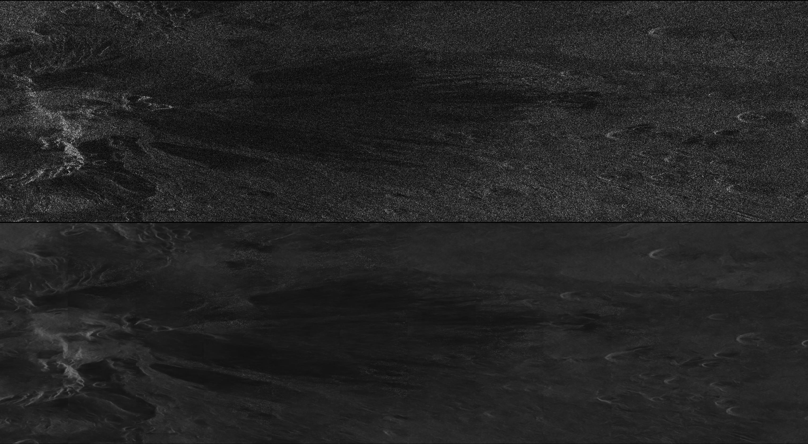

# Learned SAR Speckle Filter: Despeckling Synthetic-Aperture Radar images using a Deep Residual Convolutional Neural Network

**Tim Davis**, **Vinit Jain**

**Abstract**:

_Synthetic Aperture Radar (SAR) images suffer from the effects of speckle noise which arises from coherent
summation of the signals scattered from ground scatters distributed randomly within each pixel. Speckling
affects the human- and machine-readability of the images. Here, we propose to use deep learning to train
a convolutional neural network model that outputs a despeckled SAR image. Convolutional Neural network
architectures such as Noise2Noise and Noise2Void have been proven successful when the ground truth of the
input image is not available. Hence, the primary goal of this research project is to train a deep residual CNN
to ameliorate speckling in SAR images based on noisy input only. Lee and BM3D filters were evaluated to
compare the results. The CNN models performed comparably to the filters in terms when evaluating against
quasi-ground-truth images, and significantly outperformed the filters in terms of processing efficiency._



**<p align="center">SAR image before and after despeckling </p>**

## Principal components

### Pipeline

Please note that all code was written for and tested in Python3.

-----------------------

**filter.py**

This is the complete pipeline for processing raw SAR inputs into despeckled 
intensity images using a pretrained model.

It depends on `tif2intensity.py` for converting the raw SAR input into a
(speckled) intensity image, `predictor.py` for predicting despeckled image
patchs, and `model.util` for helper functions.

```
usage: filter.py [-h] -o OUTPUT [--channels_last] -m MODEL
                 [--mean_correction MEAN_CORRECTION] [--no_weighting] [-r]                             
                 [-s STRIDE] [--single_channel_output]                                                 
                 input                                                                                 
                                                                                                       
positional arguments:
  input                 tif image or directory of tif images

optional arguments:
  -h, --help            show this help message and exit
  -o OUTPUT, --output OUTPUT
                        output file or directory
  --channels_last       indicate if the image channels are stored last
  -m MODEL, --model MODEL
                        which model to use for processing [lin|log]
  --mean_correction MEAN_CORRECTION
                        when to apply mean-correction to images
                        [smart|always|never]
  --no_weighting        do not center-weight image patches
  -r                    recursively process subdirectories
  -s STRIDE, --stride STRIDE
                        stride when processing images (default 128)
  --single_channel_output
                        create a separate file for each channel (polarity)
```

Example usage with provided sample.tif

```
python3 filter.py -o result.tif -m lin --single_channel_output ./images/sample.tif
```


-----------------------

**tif2intensity.py**

These are helper functions for turning a raw SAR image into a (speckled) intensity
image.

-----------------------

**predictor.py**

This is a class for making predictions using specified weights.


### Training

**Dataset generation**

The model was trained using 2-channel intensity images, with the first channel for
the VH intensity image and the second channel for the VV intensity image. These 2-channel
intensity images were created from 4-channel raw SAR images using `tif2intensity.py`.

The data must be batched into sets of identical views, for which `batcher.py` was used.
This takes a `.csv` file as input that indicates to which set each image belongs (*see* 
example below) and batches each set into its own directory. Set number 0 is reserved for 
"bad" images that are either in an incorrect format or do not fit into any other set. 
These will be ignored by the batcher. Negative numbered sets are validation images
and will be excluded from the training data by `model.pairgenerator.py` during training,
but still copied to the output directory for later use in validation.

| volcano    | orbit    | image                     | set   |
|------------|---------:|---------------------------|------:|
|Ambrym      |        59| S1_20181211T182129_59_int |      0|
|...         |       ...| ...                       |    ...|


-----------------------

**train.py**

Actual training of the model is handled by `train.py`. It depends on `model.py` for 
the model specification, `pairgenerator.py` for loading the dataset, and `util.py` for 
helper functions

```
usage: train.py [-h] --image_dir IMAGE_DIR [--batch_size BATCH_SIZE]
                [--nb_epochs NB_EPOCHS] [--lr LR] [--steps STEPS]
                [--weight WEIGHT] [--output_path OUTPUT_PATH] [--model MODEL]
                [--min_date_separation MIN_DATE_SEPARATION]
                [--logspace LOGSPACE]

train noise2noise model

optional arguments:
  -h, --help            show this help message and exit
  --image_dir IMAGE_DIR
                        image dir for input and target values (default: None)
  --batch_size BATCH_SIZE
                        batch size (default: 32)
  --nb_epochs NB_EPOCHS
                        number of epochs (default: 20)
  --lr LR               learning rate (default: 0.01)
  --steps STEPS         steps per epoch (default: 32)
  --weight WEIGHT       weight file for restart (default: None)
  --output_path OUTPUT_PATH
                        checkpoint dir (default: checkpoints)
  --model MODEL         model architecture (default: red30)
  --min_date_separation MIN_DATE_SEPARATION
                        Minimum date between image pair acquisition (default:
                        6)
  --logspace LOGSPACE   Convert images to logspace before training (default:
                        False)
```

The following command was used for linear-space training: 

```shell
python ./model/train.py --image_dir ./vhvv_sets/ --batch_size 16 --nb_epochs 1000 --lr 0.001 --steps 32 --output_path ./checkpoints_vhvv_lin/ --min_date_separation 90
```

The following command was used for logarithmic-space training:

```shell
python ./model/train.py --image_dir ./vhvv_sets/ --batch_size 16 --nb_epochs 1000 --lr 0.001 --steps 32 --output_path ./checkpoints_vhvv/ --min_date_separation 90 --logspace

```

**model.py**

This contains the specification for the architecture of the model.

**pairgenerator.py**

This contains the `imgloader` class, which extends `keras.utils.Sequence` and is used for 
loading the dataset during training. All loading is done through on-the-fly loading 
of randomly selected, matching image patches.

### Evaluation

Evaluation of the results was done using `compare_psnr` and `compare_ssim` from `skimage.measure`. 
All images for two volcanoes (Ertaale and Pitonfournaise) were either dedicated to evaluation sets 
or excluded from training set, so that no knowledge of these specific volcanoes was acquired by 
the CNN during the training process.

Lee, Kuan, and Frost filters were taken from the [PyRadar](https://pypi.org/project/pyradar/) package. 
BM3D filtering was done using the [PyBM3D](https://github.com/ericmjonas/pybm3d) package.

